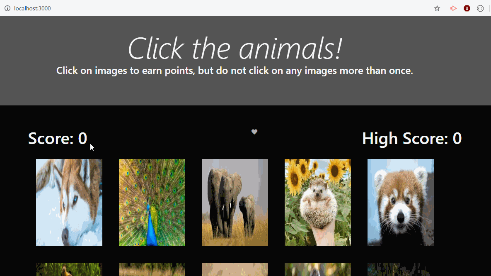
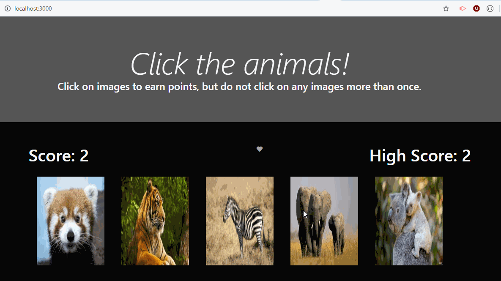
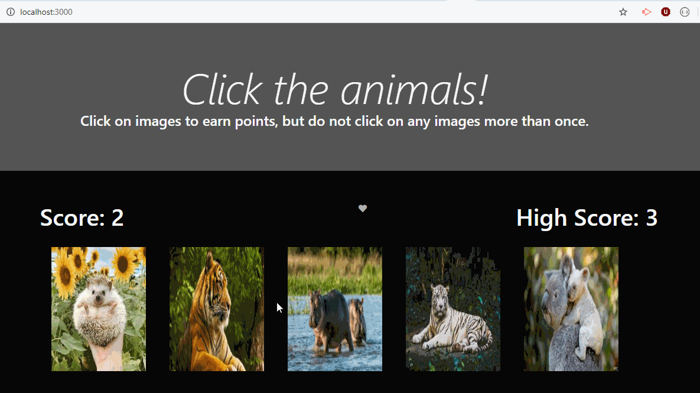

# clicky_game
A memory game for the animal in you!

## Deployed Version 
* Navigate to: https://blooming-refuge-34479.herokuapp.com

## Local Usage
* Clone this repo to your computer
* In the project directory, run `$npm install`
* Run `npm start` to start your app to use this project on your own

## About
* This project implements features of ReactJS. This activity specifically plays with a component's state as well as re-rendering web features in live time. 
* Below are some gifs demoing of the interface:

## Future Work 
* It would be fun to add animation to this project using  the animate.css library 

# 'Minders
* This project may look different in future 

## Built With
* [Javascript](https://www.javascript.com/) - The scripting language used to manipulate the DOM. 
* [Node](https://nodejs.org/en) - Javascript run-time environment (used to execute server side code.)
* [ReactJS](https://reactjs.org/)- React is a JavaScript library for building user interfaces.
* [BootStrap](https://getbootstrap.com/) -  the most popular CSS Framework for developing responsive and mobile-first websites.
* [BootSwatch](https://bootswatch.com/)- Free source for theme designed to work with Bootstrap's framework.
 

## Contributors
Laura DiTommaso - [lmd808](https://github.com/lmd808)